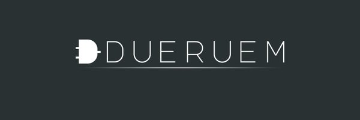

<p align="center">
  
</p>

# ddueruem


## Supported Tools

_ddueruem_ comes with support for the following libraries. ``Support'' means at a minimum that _ddueruem_ is capable of installing and running these tools.

* Installing: `> ddueruem install <tool>`
* Running (the tool's CLI): `> ddueruem run <tool>`

For certain analyses and operations (BDD compilation, Uniform Sampling, T-Wise Sampling), _ddueruem_ also brings a unified CLI that wraps inputs and outputs.

 * BDD Compilation: `> bdd --help`
 * Uniform Sampling: `> usample --help`
 * T-Wise Sampling: `> tsample --help`

Furthermore, _ddueruem_ exposes a unified API for these categories (and also Model Counting), allowing tailored and connected usage (see demos).

### BDD Compilation (`plugins/bdd`)

* [CUDD 3.0.0](https://github.com/davidkebo/cudd)
* [CNF2OBDD](https://www.disc.lab.uec.ac.jp/toda/code/cnf2obdd.html)
* [OxiDD](https://github.com/oxidd/oxidd)

### d-DNNF Compilation

* [d4](https://github.com/SoftVarE-Group/d4v2)

### Uniform Sampling (`plugins/usample`)

* [BDDSampler](https://github.com/davidfa71/BDDSampler)
* [CMSGen](https://github.com/meelgroup/cmsgen)
* [DivKC](https://github.com/serval-uni-lu/divkc)
* ddnnife (see [Frameworks](#frameworks))
* [decdnnf_rs](https://github.com/crillab/decdnnf_rs)
* [KUS](https://github.com/meelgroup/KUS)
* [Quicksampler](https://github.com/OBDDimal/quicksampler)
* [Smarch](https://github.com/jeho-oh/Smarch)
* [Spur](https://github.com/ZaydH/spur)
* [Unigen](https://github.com/meelgroup/unigen)

### T-Wise Sampling (`plugin/tsample`)

* ddnnife (see [Frameworks](#frameworks))
* YASA (FeatJAR, see [Frameworks](#frameworks))

### Preprocessing (`plugin/preprocessing`)

* [Arjun](https://github.com/meelgroup/arjun)
* [PMC](https://www.cril.univ-artois.fr/kc/pmc.html)

### Frameworks
See  `plugin/frameworks`:

* [ddnnife](https://github.com/SoftVarE-Group/d-dnnf-reasoner)
* [FeatJAR](https://github.com/FeatureIDE/FeatJAR)

### Misc
See  `plugin/misc`:

* [uvl2dimacs](https://github.com/rheradio/uvl2dimacs)

## Setup

### Requirements
* Python 3.14+

### Installation
#### From PyPi (https://pypi.org/project/ddueruem/):
> `pip install ddueruem`

#### From Source:
* Clone this repository
* Create a [virtual environment](https://docs.python.org/3/library/venv.html): `python -m venv .venv`

* Activate the virtual environment: `source .venv/bin/activate`

* Install the dependencies: `pip install -e .`

* Execute the test suite: `python -m pytest tests`  or  `./run_tests.sh`


## How to cite
Please cite our [work from SPLC'22](https://dl.acm.org/doi/abs/10.1145/3503229.3547032):
```bibtex
@inproceedings{HMT+:SPLC22,
    author = {He\ss{}, Tobias and M\"{u}ller, Tobias and Sundermann, Chico and Th\"{u}m, Thomas},
    title = {ddueruem: a wrapper for feature-model analysis tools},
    year = 2022,
    isbn = {9781450392068},
    publisher = {Association for Computing Machinery},
    address = {New York, NY, USA},
    url = {https://doi.org/10.1145/3503229.3547032},
    doi = {10.1145/3503229.3547032},
    booktitle = {Proceedings of the 26th ACM International Systems and Software Product Line Conference - Volume B},
    pages = {54–57},
    numpages = {4},
    keywords = {benchmark, feature-model analysis, knowledge compilation, sampling},
    location = {Graz, Austria},
    series = {SPLC '22}
}
```

# Changelog

### v0.9.1
* Enhanced CLI
* Added explicit support for d4
* Added support for decdnnf_rs, uvl2dimacs
* Improved BDD Compilation with CUDD
* Homogenized dddmp exporting
* Many bug fixes